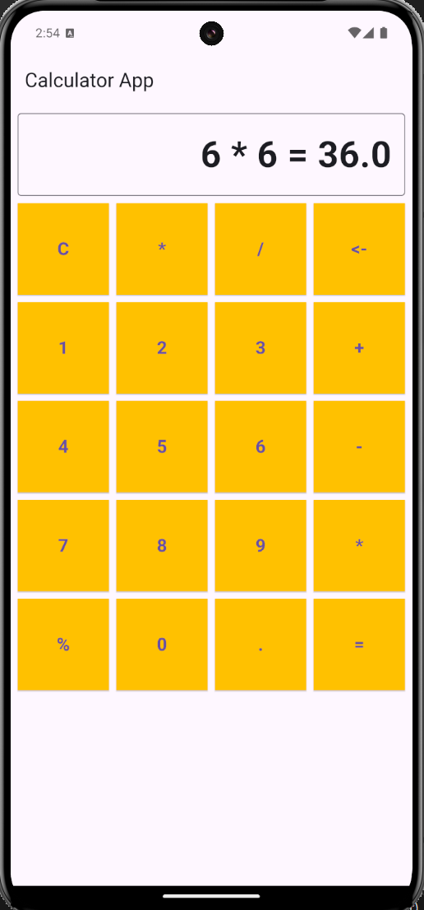

# Calculator App Project

## GitHub Repository Link
[GitHub Repository](https://github.com/avishek100/calculator_app.git)





## How to Run the Project
1. Clone the repository:

   ```bash
   git clone https://github.com/avishek100/calculator_app.git